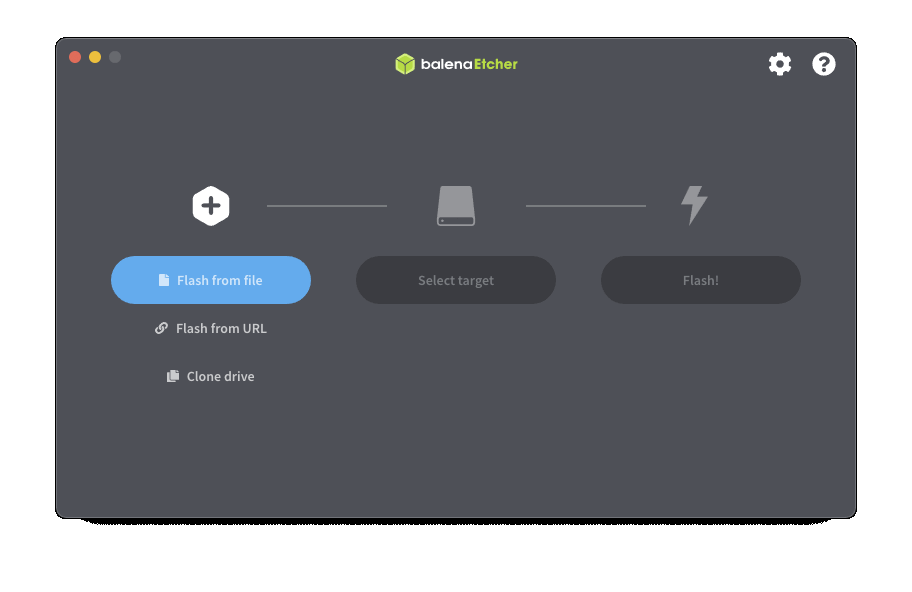
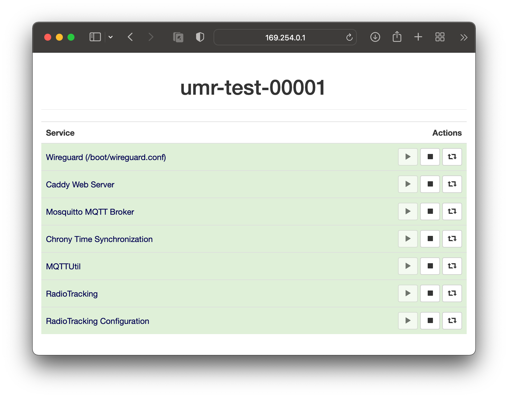
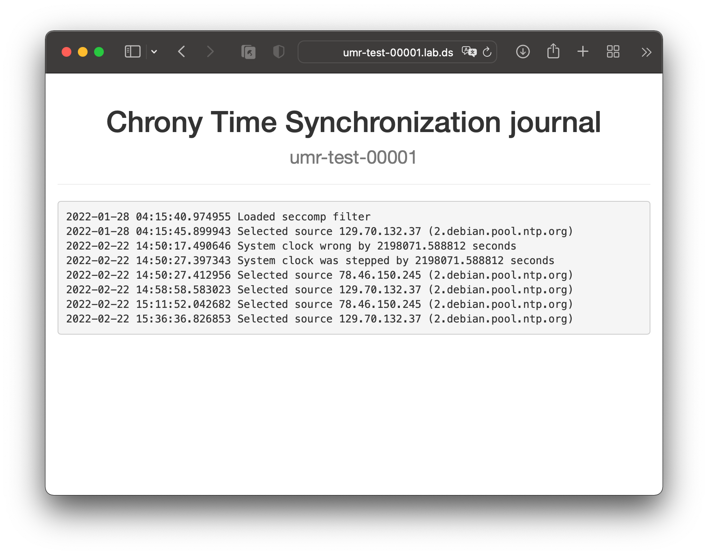
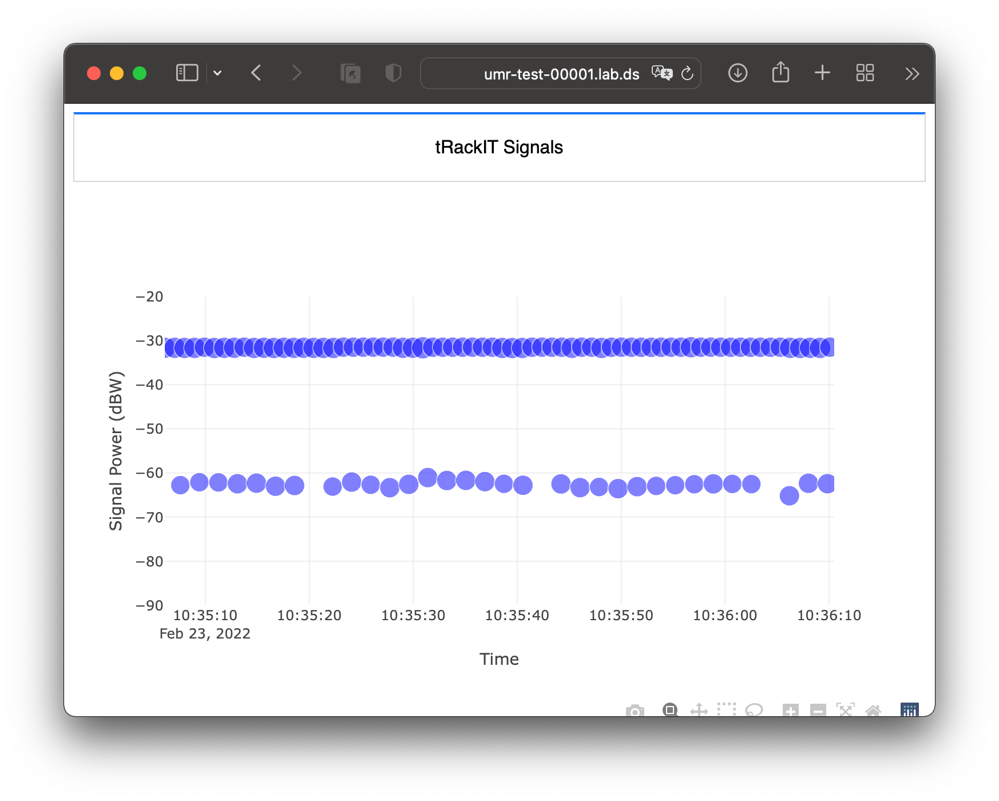
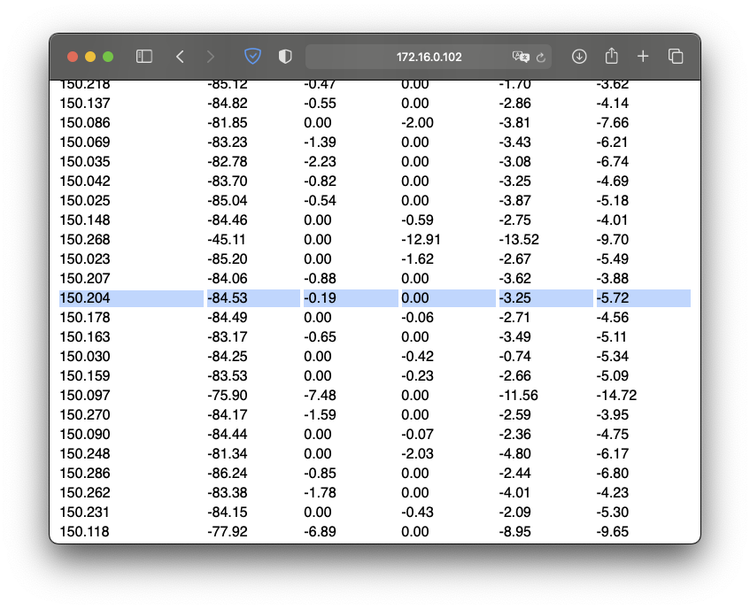

# Quickstart
In this quick start guide, we assume that a tRackIT station is already available and that it is now to be equipped and operated with the tRackIT OS.

## 1. Download OS image
As usual in the field of single boards like the Raspberry Pi, the Operating System (OS) is delivered as an image, i.e. a file that can be transferred directly to an SD card.
*tRackIT OS* can be downloaded at the [releases section of the respective Github repository](https://github.com/Nature40/tRackIT-OS/releases). 
Download the file *tRackIT-x.y.z.zip* of the most recent release. 
Pre-release versions can also be tried out, but they may not have been tested yet and may not work to their full potential.

## 2. Flash Image
A particularly user-friendly alternative for flashing Operating System Images is [BalenaEtcher](https://www.balena.io/etcher/), which is described here as an example. 
BalenaEtcher allows to unzip and flash the downloaded `.zip` file to an SD card:

1. Insert an SD card into your computer.
2. Select the downloaded file BalenaEtcher using "Flash from File".
3. Select the SD card and start the transfer by clicking on "Flash!".

> Note: BalenaEtcher might ask for permissions to be granted.

## 3. Configure Station
After flashing the card, remove and insert the SD card again to access the `boot` partition.
There are multiple files containing the configuration of the station:

1. Hostname: The last entry of `cmdline.txt` contains the hostname which can be set according to [Linux hostname rules](https://man7.org/linux/man-pages/man7/hostname.7.html). Valid characters for hostnames are ascii letters from a to z, the digits from 0 to 9, and the hyphen (-).
> Note: Please follow the schema `<planner>-<project>-<number>`, as your matching of individuals in the backend will depend on the planner and project values. Every station name can only be used once. 

2. Wireguard VPN: *tRackIT OS* supports remote access through wireguard. A configuration file named `wireguard.conf` can be added to the boot partition to enable this feature.
> Note: Every station needs an individual certificate, as wireguard uses identity-based crypto.

3. MQTT Server: The MQTT server is configured the configuration files in the `mosquitto.d` directory. 
> Note: For MQTT the same server configuration is reused for all stations, as only the server authenticates against the client. 

4. Signal Detection: The signal detection algorithm's configuration can be adjusted in the `radiotracking.ini` file.
> Note: This configuration file can also be adjusted using the RadioTracking Configuration WebUI ([http://169.254.0.1/radiotracking-config/](http://169.254.0.1/radiotracking-config/)).

## 4. Deploy Station
Remove the SD card from your computer (using save eject / unmount), insert it into the *tRackIT station's* Raspberry Pi and boot the station by connecting the power cable.

> Note: The first boot takes up to a few minutes, depending on the speed and size of the SD card, because the file system is adjusted to the size of the SD card. 

The station can be accessed through Wi-Fi, where the network name (SSID) is the previously configured hostname. 
The default password is `BirdsAndBats`.

The *tRackIT station* uses the IPv4 address 169.254.0.1 and a WebUI can be accessed via [http://169.254.0.1](http://169.254.0.1). 
There are multiple entries serving different purposes:

* `boot`: contents of the `boot` partition, i.e. the configuration,
* `radiotracking`: signal detection web interface and configuration screen,
* `sysdweb`: service control, i.e. start and stop services, access logfiles,
* `<hostname>`: data collected at the specific station.

### Check Sysdweb
To check that everything's working, first access `sysdweb` ([http://169.254.0.1/sysdweb](http://169.254.0.1/sysdweb)).
Sysdweb requires authentication, `tRackIT OS` uses the `pi` user's default passwort is `natur`. 

All services in green are up and running. The log messages of the running services can be accessed by clicking the service name, which allows for further troubleshooting.

### Check RadioTracking
Next, access `radiotracking` to check if a nearby VHF transmitter is received correctly ([http://169.254.0.1/radiotracking](http://169.254.0.1/radiotracking)).

The dots in blue indicate that a VHF transmitter is received on SDR 0 (north) which indicates signal detection is running correctly. 

## 5. Configuration & Calibration
*tRackIT stations* require to be calibrated when set up for the first time, since the used SDR devices differ in signal attenuation. To calibrate a station follow this routine: 

1. Place a VHF transmitter roughly 150 meters away from the station.
2. Access the *Configuration* pane, enable calibration mode and click *Save* and *Restart*.
3. Slowly and carefully rotate the stations antennas by at least 360° and back to the default orientation.
4. Find the frequency of your VHF transmitter in the *Graphs* pane and note or copy the calibration values.
5. Open the *Configuration* pane, disable the calibration mode and enter the calibration values into the respective fields and click *Save* and *Restart*.

## 6. Management

The tRackIT Station is now up and running and will do so, as long as no errors do occur. Common errors, their reasons and what can be done can be read in the [Troubleshooting](./Troubleshooting.html) section.
