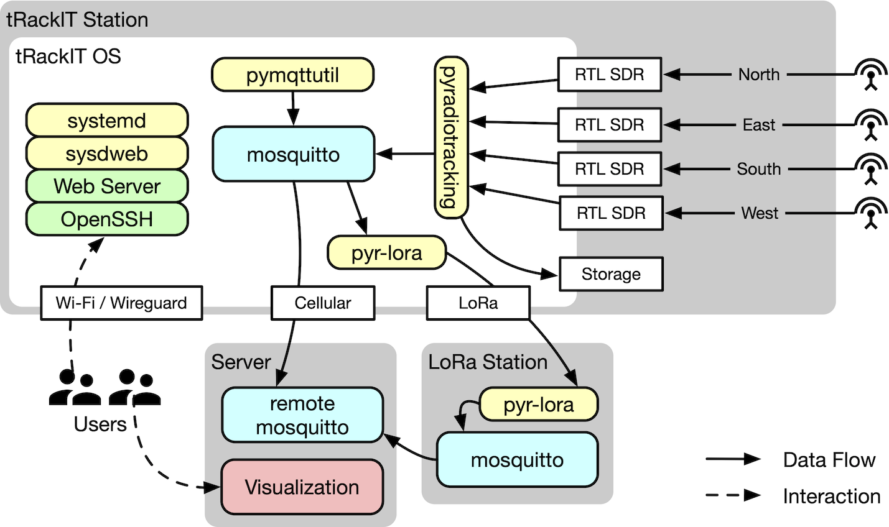

# Operation

The *tRackIT OS* consists of multiple components responsible for signal detection ([`pyradiotracking`](https://github.com/Nature40/pyradiotracking)), configuration and maintenance ([`pymqttutil`](https://github.com/Nature40/pymqttutil), [`systemd`](https://www.freedesktop.org/wiki/Software/systemd/), [`sysdweb`](https://github.com/ogarcia/sysdweb), `pyradiotracking-lora`) and communication ([`wireguard`](https://www.wireguard.com), [`mosquitto`](https://mosquitto.org), [`caddy`](https://caddyserver.com), `ssh`).
The services are interleaved and do rely on each other at multiple points.
The goal of this page is to present the operating system configuration and make automatic error detection and correction more transparent.



## Error Detection and Recovery

Errors in signal detection are detected and handled at multiple stages. 
To understand problematic situations, system reporting and logging of certain error cases better, it is helpful to understand the basic operation.

### Robustness in `pyradiotracking`
The signal detection program, called `pyradiotracking` has a set of error detection and correction methods.

First, every data stream of an SDR is analyzed in a separate process. 
Theses processes monitor themselves such that an internal timestamp is computed based on the samples received from the SDR and compared to the system clock.
If the samples are lacking behind more than the configured `sdr_timeout_s`, some samples have been skipped and the time of a detected signal is not accurate anymore. 
The error is reported as and the analyzer is terminated:
```
SDR 0 total clock drift (2.612 s) is larger than two blocks, signal detection is degraded. Terminating...
```

> Note: The error is also a useful hint, that system load is too high for the given configuration, [see troubleshooting](troubleshooting#the-trackit-station-keeps-on-restarting).

In addition to this, every analyzer process (re-)sets a timer when receiving samples, which triggers, if no block is received at all within the configured `sdr_timeout_s`:
```
SDR 0 received SIGALRM, last data received 2.114 ago.
```

Second, `pyradiotracking` has a central monitoring loop which checks the timestamp of the last received sample block. 
If the timestamp of the last block is beyond the configured timeout (`sdr_timeout_s`), the analyzer is terminated:
```
SDR 0 received last data 2021-06-21 20:27:55.215609; timed out.
```

When an analyzer is terminated, the central monitoring loop restarts the analyzer up to `sdr_max_restart` times. 
All other analyzers are allowed to continue operation normally. 
However, if the restart count is reached, `pyradiotracking` will terminate itself.

### Restarting of `pyradiotracking`
`systemd` keeps track of the `radiotracking` service.
Should `pyradiotracking` terminate itself or crash in some way, it restarts the service after a 10 seconds pause.
However, if more than five restarts occur over the duration of 10 minutes, the system will reboot itself.
Rebooting the system also restarts the USB stack which can sometime help to mitigate errors in signal retrieval.

> Note: When debugging errors or copying data from failed stations, the automatic rebooting can sometimes be annoying. You can always disable the `radiotracking` service using `sudo systemctl stop radiotracking`.

## Monitoring 
There are different measuring instruments showing different aspects of a *tRackIT station's* health state.
While all of the values are helpful in certain ways, some values can lead to wrong conclusions.

### `sysdweb` Color Indicator
The color indicated by `sysdweb` does not represent the internal state of, e.g. `pyradiotracking`. 
It shows wether the `radiotracking` service is running or has failed. 
If the respective service is marked green, it can still be possible, that `pyradiotracking` is starting a single failed logger over and over again. 

### Uptime
The uptime is a useful indicator to assess the general health state of a station.
If the uptime is low, and the station is restarting over and over again, it can be a simple indicator for a [configuration of high demand or failing hardware](troubleshooting#the-trackit-station-keeps-on-restarting).

### Detected Signals
Since signal detection is the main goal of the stations, observation of the detected signals it is the most direct evidence of a functioning station.
However, it is not always reliable, since there may not be a VHF tag around all the time to be detected by the station.
In addition it would also be necessary to watch the signals detected on all SDRs, since single failing SDRs could not be identified looking only at matched signals. 
