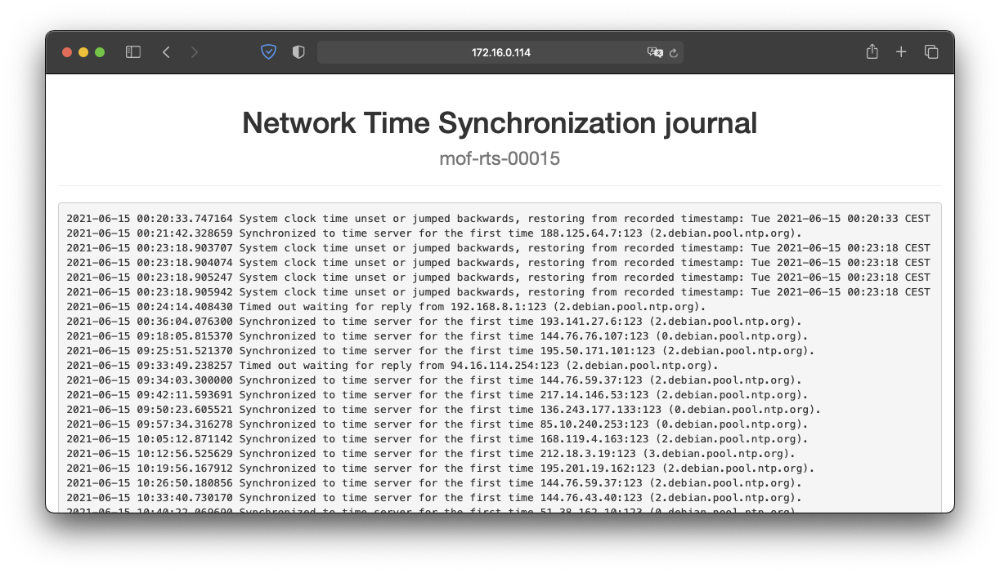

# Troubleshooting
In this section, common errors and problems are described and potential solutions are discussed. 

> Note: The solutions discussed in this section are not intended to be definitive, but should serve as a possible starting point for resolution.

## The *tRackIT station* keeps on restarting.
There are multiple reasons why *pyradiotracking* or the *tRackIT station* keeps on restarting, the underlying problems are:
1. A bad USB connection of an SDR stick or the USB hub;
2. A broken or failing SDR stick or
3. High system load or high temperatures. 

Bad connections and failing SDR sticks can be identified by [looking at `pyradiotrackings` log files](tasks#investigate-log-files) and check if the same SDR is failing over and over again:

```console
Jun 15 16:03:13 mof-rts-00015 bash[1135]: WARNING:radiotracking:SDR 1 will be restarted.
Jun 15 16:03:14 mof-rts-00015 bash[1135]: Found Rafael Micro R820T tuner
Jun 15 16:03:14 mof-rts-00015 bash[1135]: [R82XX] PLL not locked!
Jun 15 16:03:14 mof-rts-00015 bash[1135]: Allocating 15 zero-copy buffers
Jun 15 16:03:19 mof-rts-00015 bash[1135]: WARNING:radiotracking.analyze:SDR 1 total clock drift (0.93777 s) is larger than two blocks, signal detection is degraded. Terminating...
Jun 15 16:03:21 mof-rts-00015 bash[1135]: WARNING:radiotracking:SDR 1 will be restarted.
Jun 15 16:03:22 mof-rts-00015 bash[1135]: Found Rafael Micro R820T tuner
Jun 15 16:03:22 mof-rts-00015 bash[1135]: [R82XX] PLL not locked!
Jun 15 16:03:14 mof-rts-00015 bash[1135]: Allocating 15 zero-copy buffers
...
```
The multiple restarting of SDR 1 indicates, that its connection or the device itself is broken and should be checked and potentially replaced. 

If the different SDRs are failing and restarting at random, it is more likely that the system has a general problem.

```console
Jun 15 16:04:03 mof-rts-00015 bash[1246]: WARNING:radiotracking.analyze:SDR 1 total clock drift (1.03648 s) is larger than two blocks, signal detection is degraded. Terminating...
Jun 15 16:04:04 mof-rts-00015 bash[1246]: WARNING:radiotracking.analyze:SDR 2 total clock drift (0.91334 s) is larger than two blocks, signal detection is degraded. Terminating...
Jun 15 16:04:04 mof-rts-00015 bash[1246]: WARNING:radiotracking.analyze:SDR 3 total clock drift (0.91257 s) is larger than two blocks, signal detection is degraded. Terminating...
Jun 15 16:04:05 mof-rts-00015 bash[1246]: WARNING:radiotracking:SDR 1 will be restarted.
Jun 15 16:04:05 mof-rts-00015 bash[1246]: WARNING:radiotracking:SDR 2 will be restarted.
Jun 15 16:04:05 mof-rts-00015 bash[1246]: WARNING:radiotracking:SDR 3 will be restarted.
Jun 15 16:04:05 mof-rts-00015 bash[1246]: Found Rafael Micro R820T tuner
Jun 15 16:04:06 mof-rts-00015 bash[1246]: Found Rafael Micro R820T tuner
Jun 15 16:04:06 mof-rts-00015 bash[1246]: Found Rafael Micro R820T tuner
Jun 15 16:04:06 mof-rts-00015 bash[1246]: [R82XX] PLL not locked!
Jun 15 16:04:06 mof-rts-00015 bash[1246]: [R82XX] PLL not locked!
Jun 15 16:04:06 mof-rts-00015 bash[1246]: [R82XX] PLL not locked!
Jun 15 16:04:06 mof-rts-00015 bash[1246]: Allocating 15 zero-copy buffers
Jun 15 16:04:06 mof-rts-00015 bash[1246]: Allocating 15 zero-copy buffers
Jun 15 16:04:06 mof-rts-00015 bash[1246]: Allocating 15 zero-copy buffers
```

The warning message in line 1 indicates that data is not analysed fast enough on this station, which leads to the analyzer being restarted. 
Low power, hot temperatures and demanding settings (including high numbers of VHF transmitters) can lead to loads higher than the system capacity triggering this behavior. 
To cope with the problem:
1. Check the hardware, especially the heat sink, and the temperature monitoring if the temperature is below 80 °C;
2. Check the power connection to the Raspberry Pi and the USB hub; and
3. Alter settings, e.g., raise `signal_threshold_dbw`, `snr_threshold_db` and `signal_min_duration_ms`.

## The *radiotracking* won't start, even though WiFi / sysdweb is available. 
The radiotracking signal detection algorithm does not only rely on working SDR sticks, but also on correct date and time.
It is assumed that detected signals from multiple stations are processed further, e.g. for bearing calculation and triangulation, correct date and time is required to match signals of multiple stations. 
Hence if the station is booted and the time could not be synced via NTP, the radiotracking service won't start. 

First you may check sysdweb for potential log error messages: 


While there might be problems to specific custom configurations, the most common error is that the cellular network connection is not working.  
You can check this by [logging in via SSH](tasks#login-via-ssh) and using the `ping` utility:
```console
pi@mof-rts-00015:~ $ ping -c4 8.8.8.8
PING 8.8.8.8 (8.8.8.8) 56(84) bytes of data.

--- 8.8.8.8 ping statistics ---
4 packets transmitted, 0 received, 100% packet loss, time 53ms
```
The example above shows, that the network connection is not working correctly.

You can further check if the LTE stick is recognized by *tRackIT OS* using `ip`:
```console
pi@mof-rts-00015:~ $ ip addr show eth1
4: eth1: <BROADCAST,MULTICAST,UP,LOWER_UP> mtu 1500 qdisc pfifo_fast state UP group default qlen 1000
    link/ether 0c:5b:8f:27:9a:64 brd ff:ff:ff:ff:ff:ff
    inet 192.168.8.100/24 brd 192.168.8.255 scope global dynamic eth1
       valid_lft 71231sec preferred_lft 71231sec
    inet6 fe80::e6df:61b:1a11:c575/64 scope link 
       valid_lft forever preferred_lft forever
```

If the above output (or comparable) is presented, the device is detected correctly.
If `ip` shows an error, e.g. `Device "eth1" does not exist.`, the device is not detected correctly or broken. 
You may replug or replace the respective modem.

If it is connected correctly and still not working, it might be, that the cellular connection is weak or that the cellular plan is used up.
Connect the cellular modem to a laptop and try to fix the connection issues specific to your used modem and cellular provider.

## The station appears to be running but is not accessible via WiFi or cellular network. 
Unfortunately in some situations *tRackIT stations* hang up in a non-recoverable way.
The red and green lights of the Raspberry Pi might still be lit or even blinking and the WiFi SSID is still shown at your host.
When trying to connect to the WiFi, no IP address is given and no connection can be made.
Also access through the wireguard VPN is not possible.
At the time of writing the underlying error was not figured out, but it is suspected that some hardware defect might be a cause.

Currently the only option is to restart the station manually by removing the power for some seconds.  
